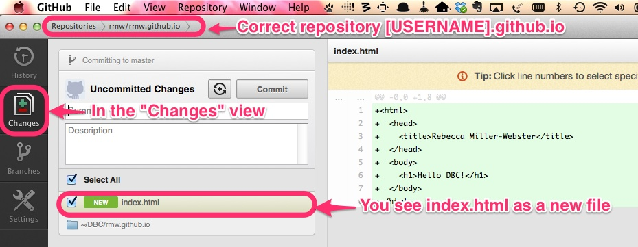
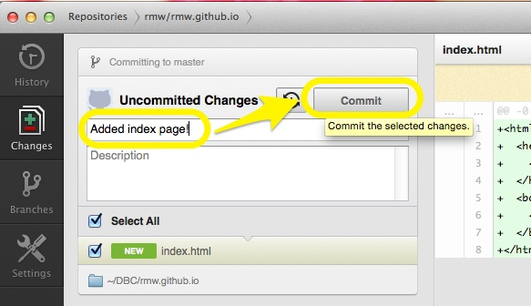

[Back](README.md)

# Basics of the Web

## Learning Competencies

- Describe the following: web server, browser, HTML, CSS, domain, DNS
- Create an HTML file
- Commit and push a file to GitHub

## Release 0: Learn

#### Web Concepts

* Slides: [Intro to Web Concepts](http://girldevelopit.github.io/girldevelopit-rdu-access/classslides.html#/)
* Read: Web concepts -- [Internet vs. Web](http://skillcrush.com/2012/08/19/the-internet-vs-the-web/), [Web Browser](http://skillcrush.com/2012/10/01/web-browsers/), [Web Server](http://skillcrush.com/2012/07/03/web-server-2/)
* Read: [Web site vs Web App](http://skillcrush.com/2013/03/28/websites-vs-web-applications/)
* Read: Domain concepts -- [What's a domain](http://skillcrush.com/2012/11/01/domain-2/), [DNS](http://skillcrush.com/2012/04/24/dns/), [IP Address](http://skillcrush.com/2012/07/03/ip-address-2/)
* Read: [Introduction to DNS](http://coding.smashingmagazine.com/2011/05/25/introduction-to-dns-explaining-the-dreaded-dns-delay/)
* Read: [What's HTML?](http://skillcrush.com/2012/04/02/html/)

#### More about Git

* Read: [Recording Changes to your Git Repository](http://git-scm.com/book/en/Git-Basics-Recording-Changes-to-the-Repository)

**Optional resources**

* Read: [git commit](https://www.atlassian.com/git/tutorial/git-basics#!commit)
* Read: [git log aka git history](https://www.atlassian.com/git/tutorial/git-basics#!log)

## Release 1: Create a web page

Now let's put that knowledge to work!  We will be using [Sublime Text](http://www.sublimetext.com/) as our [text editor](http://skillcrush.com/2012/09/10/text-editor/).  Review the [Perfect Workflow in Sublime Text](http://code.tutsplus.com/articles/perfect-workflow-in-sublime-text-free-course--net-27293) if you need a refresher on how to write code using Sublime.

* **Open a new file in Sublime**
* Save the file as `index.html` in the **same directory as your copy of [USERNAME].github.io**  
* Add the following **HTML code** to your file: `<html><body>Hello DBC!</body></html>`
* **Save the file**

## Release 2: Save your page to GitHub

If you are **NOT** using Mac or Windows and the GitHub App, [follow this tutorial](http://readwrite.com/2013/10/02/github-for-beginners-part-2#awesm=~oxToOt4ihQmVCP) and then skip to release 4.

* **Open the GitHub App**<ul><li>You should be in your [USERNAME]/[USERNAME].github.io repository</li><li>You should be in the "Changes" view</li><li>You should see `index.html` in the list of changes as a new file</li></ul>
* **Type a "commit message"**  A commit message is a description of all the files and changes that are part of the "snapshot" (or commit) you are about to save.  If another programmer only read the commit, they should understand what was changed (or added or deleted) and why.  
* **Click on the "Commit" button** *If you get an alert about saving credentials, choose "Always Allow"*
* **View your commit**<ul><li>Click on "History" in the left sidebar</li><li>History shows all the commits anyone has made</li><li>It's kind of awesome</li></ul>  

## Release 3: Push your page to GitHub

Click on the **Sync Branch** button in the upper right corner.

## Release 4: View your site

It's now time for the big reveal!! 

Go to **http://[USERNAME].github.io** to see your HTML page live!

You can also see the new index.html file in your GitHub repository!

#### [AMAZING!](http://www.youtube.com/watch?v=ewfIvKbuRUg)

## Release 5: Reflection

Now you will want to practice what you've learned in this challenge (and don't worry, you'll get to go through this reflection workflow for the rest of phase 0).

In the GitHub app (or via your terminal), go to your [USERNAME]/phase_0_unit_1 repository (that you forked in challenge 1). Clone it to your computer. Then, open the terminal and navigate to that repository. Open the repository in Sublime. You can do this by either adding sublime shortcuts to your command line or opening sublime and opening the repository from there. 

Navigate to the 3_web_basics/my_reflection.md file. Answer the questions there. Save your file, commit your changes, and sync the repo. You should be able to see your reflection on your forked repo on github.com.

You should edit all code, reflections, etc. from your local text editor. It's bad practice to make changes from github.com. (So forget we told you to do that in the past two challenges)! 

